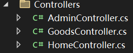
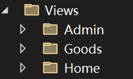
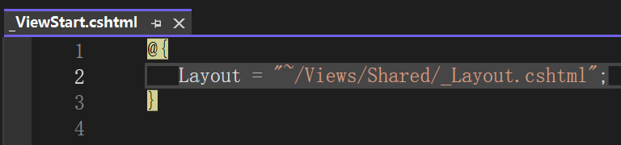
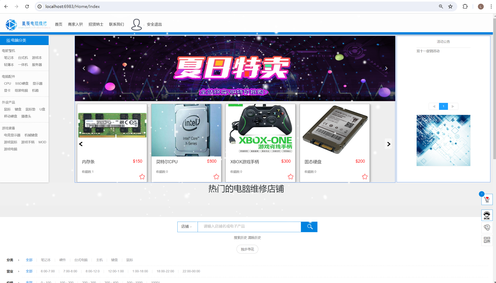
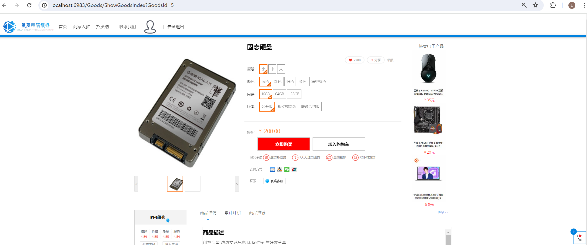
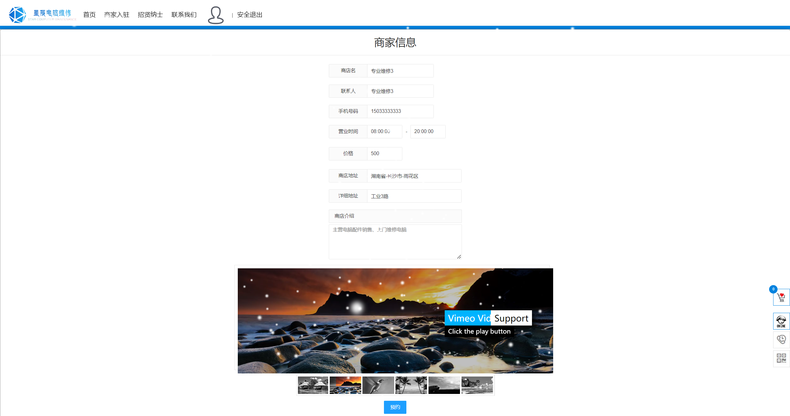
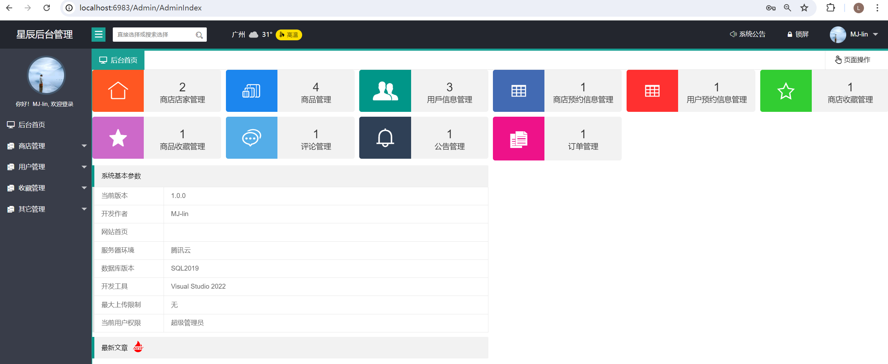
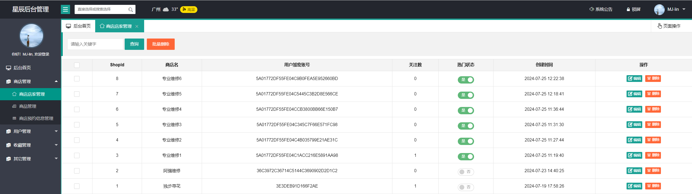
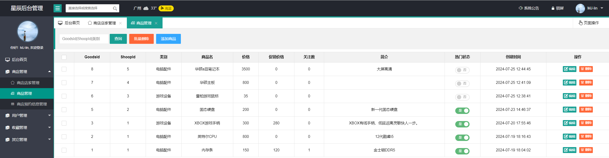
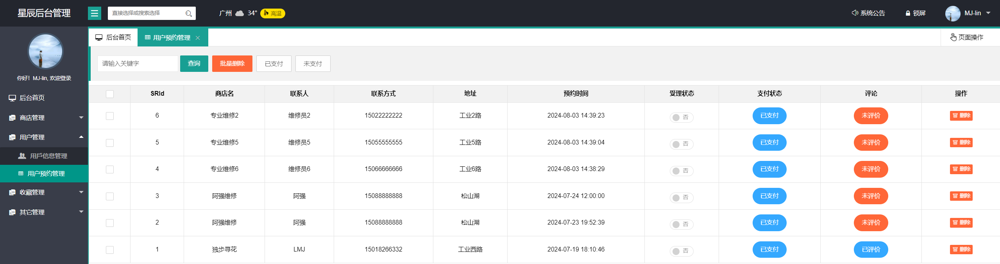

简介
-
&nbsp;&nbsp;&nbsp;&nbsp;&nbsp;&nbsp;本项目是一个电脑维修预约平台(Computer Matain)。商家在平台上开设店铺接收预定并提供上门维修电脑服务，同时还可以上架电脑零配件等商品提供网购业务；顾客可以在平台上预约相应店铺的上门维修电脑服务、购买商品。项目后端使用.NET Frameworke4.8+ASP.NET MVC 框架开发；前端使用LayUI组件库+JQuery实现。

本项目主要实现了以下功能点：

1、用户注册、登录、权限校验、个人信息管理。

2、平台商家入驻、管理店铺、处理预约订单、管理店铺商品信息。

3、顾客浏览商品、添加购物车、收藏店铺、发布预约订单、对服务进行评价。

4、平台管理员管理店铺、设置热门商店商品、发布公告、查看交易数据等。

项目结构
-
* Global.asx.cs文件是程序的入口文件，项目启动时将会加载APP_Start文件夹下的配置文件。
```C#
namespace CPMA
{
    public class MvcApplication : System.Web.HttpApplication
    {
        protected void Application_Start()
        {
            AreaRegistration.RegisterAllAreas();
            FilterConfig.RegisterGlobalFilters(GlobalFilters.Filters);
            RouteConfig.RegisterRoutes(RouteTable.Routes);
            BundleConfig.RegisterBundles(BundleTable.Bundles);
        }
    }
}
```

* 使用MVC架构，Controller与View使用框架默认的形式进行匹配。
  



* View组件会自动加载_ViewStart.cshtml布局文件，该布局文件加载_Layout.cshtml使每个View应用自定义布局




项目截图
-
* 客户端首页

* 购物界面

* 预约上门服务

* 管理员首页

* 商店管理

* 商品管理

* 预约信息管理



  
  
